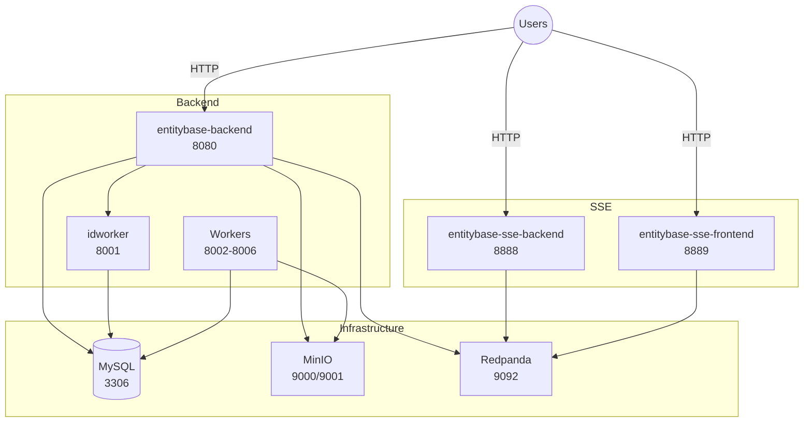

# Entitybase Orchestrator

Docker orchestration for Entitybase services.

## Architecture



## Quick Start

```bash
# Copy environment template
cp .env.example .env

# Build Docker images and start services
make run
```

## Makefile Commands

| Command | Description |
|---------|-------------|
| `make build` | Build all Docker images |
| `make run` | Build images and start all services |
| `make stop` | Stop all running services |
| `make remove` | Stop services and remove containers/volumes |
| `make clean` | Prune Docker system (containers, images, networks, build cache) |
| `make reset` | Reset entitybase data (runs reset.sh) |

## Manual Commands

```bash
# Build images
./build-images.sh

# Start services
docker compose up -d

# View logs
docker compose logs -f

# Stop services
docker compose stop
```

## Services

| Service | Port | Description |
|---------|------|-------------|
| mysql | 3306 | Database |
| minio | 9000, 9001 | S3 storage (API + console) |
| redpanda | 9092, 9644 | Kafka broker |
| redpanda-console | 8084 | Redpanda Console (Kafka UI) |
| entitybase-backend | 8080 | REST API |
| entitybase-sse-backend | 8888 | SSE API |
| entitybase-sse-frontend | 8889 | SSE Frontend |
| idworker | 8001 | ID generation |

## Profiles

- `core` - Infrastructure + main services (default)
- `workers` - Background job workers

```bash
# Start with workers
docker compose --profile workers up -d
```

## Docker Images

The following custom images must be built before running:

- `entitybase-backend:latest` - from `entitybase-backend/docker/containers/Dockerfile.api`
- `entitybase-sse-backend:latest` - from `entitybase-sse/Dockerfile`
- `entitybase-sse-frontend:latest` - from `entitybase-sse/frontend/Dockerfile`

Run `make build` to build all images.

## License

This project is licensed under the [GNU General Public License v3.0 or later](LICENSE).

## Environment Variables

| Variable | Default | Description |
|----------|---------|-------------|
| MYSQL_ROOT_PASSWORD | (empty) | MySQL root password |
| MINIO_ROOT_USER | fakekey | MinIO access key |
| MINIO_ROOT_PASSWORD | fakesecret | MinIO secret key |

## External links
* https://www.wikidata.org/wiki/Wikidata:Tools/Entitybase
