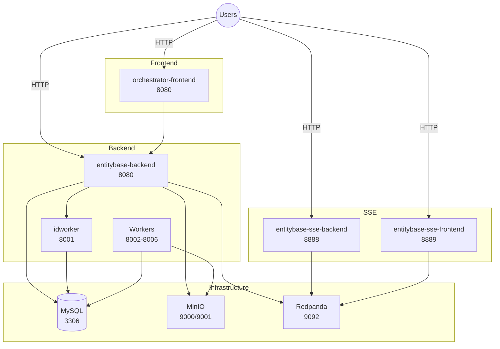

# Entitybase Orchestrator

Docker orchestration for Entitybase services.

## Architecture



## Quick Start

```bash
# 1. Clone all sub-repositories (first time only)
make git-clone-all

# 2. Initialize environment (creates .env, prompts for HOST)
make setup

# 3. (Optional) Mount tmpfs for faster build performance
make tmpfs-setup

# 4. Build Docker images
make build

# 5. Start core services
make run-core
```

## Dependencies

See [INSTALL.md](INSTALL.md) for installation instructions.

## Makefile Commands

| Command | Description |
|---------|-------------|
| `make git-clone-all` | Clone all sub-repositories (required before `make setup`) |
| `make setup` | Initialize environment (creates .env, prompts for HOST) |
| `make tmpfs-setup` | Mount tmpfs for build cache and volumes (recommended before build) |
| `make build` | Build all Docker images |
| `make run-core` | Start core services |
| `make run-core-workers` | Start core + workers |
| `make stop` | Stop all running services |
| `make remove` | Stop services and remove containers/volumes |
| `make clean-all` | Remove locally built images, containers, volumes, and build cache |
| `make check` | Check service health status |
| `make show-images` | Show all entitybase Docker images |

## Manual Commands

```bash
# Build images
./build-images.sh

# Start services
docker compose up -d

# View logs
docker compose logs -f

# Stop services
docker compose stop
```

## Services

| Service | Port | Description |
|---------|------|-------------|
| mysql | 3306 | Database |
| minio | 9000, 9001 | S3 storage (API + console) |
| redpanda | 9092, 9644 | Kafka broker |
| redpanda-console | 8084 | Redpanda Console (Kafka UI) |
| entitybase-backend | 8080 | REST API |
| entitybase-sse-backend | 8888 | SSE API |
| entitybase-sse-frontend | 8889 | SSE Frontend |
| idworker | 8001 | ID generation |

## Profiles

- `core` - Infrastructure + main services (default)
- `workers` - Background job workers

```bash
# Start with workers
docker compose --profile workers up -d
```

## License

This project is licensed under the [GNU General Public License v3.0 or later](LICENSE).

## Environment Variables

See [INSTALL.md](INSTALL.md) for full list.
