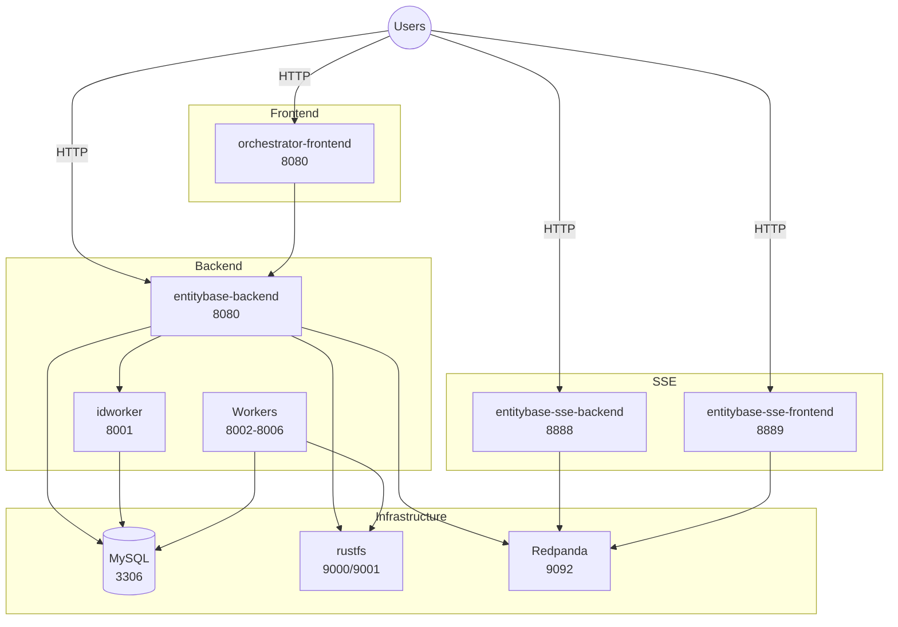

# Entitybase Orchestrator

Docker orchestration for Entitybase services.

## Architecture


```mermaid
flowchart TB
    subgraph Infrastructure
        MySQL[(MySQL<br/>3306)]
        Rustfs[rustfs<br/>9000/9001]
        Redpanda[Redpanda<br/>9092]
    end

    subgraph Backend
        API[entitybase-backend<br/>8080]
        ID[idworker<br/>8001]
        Workers[Workers<br/>8002-8006]
    end

    subgraph Frontend
        Orch[orchestrator-frontend<br/>8080]
    end

    subgraph SSE
        SSE_BE[entitybase-sse-backend<br/>8888]
        SSE_FE[entitybase-sse-frontend<br/>8889]
    end

    Users((Users))

    Users -->|HTTP| Orch
    Users -->|HTTP| API
    Users -->|HTTP| SSE_BE
    Users -->|HTTP| SSE_FE

    Orch --> API

    API --> MySQL
    API --> Rustfs
    API --> Redpanda
    API --> ID

    ID --> MySQL

    Workers --> MySQL
    Workers --> Rustfs

    SSE_BE --> Redpanda
    SSE_FE --> Redpanda
```

## Quick Start

```bash
# 1. Clone all sub-repositories (first time only)
just git-clone-all

# 2. Initialize environment (creates .env, prompts for HOST)
just setup

# 3. Build Docker images
just build

# 5. Start core services
just run-core
```

## Dependencies

See [INSTALL.md](INSTALL.md) for installation instructions.

## Commands

| Command | Description |
|---------|-------------|
| `just git-clone-all` | Clone all sub-repositories (required before `just setup`) |
| `just setup` | Initialize environment (creates .env, prompts for HOST) |
| `just build` | Build all Docker images |
| `just run-core` | Start core services |
| `just run-core-workers` | Start core + workers |
| `just stop` | Stop all running services |
| `just remove` | Stop services and remove containers/volumes |
| `just clean-all` | Remove locally built images, containers, volumes, and build cache |
| `just check` | Check service health status |
| `just show-images` | Show all entitybase Docker images |

Run `just` (or `just --list`) to see all available recipes.

## Manual Commands

```bash
# Build images
./build-images.sh

# Start services
docker compose up -d

# View logs
docker compose logs -f

# Stop services
docker compose stop
```

## Services

| Service | Port | Description |
|---------|------|-------------|
| mysql | 3306 | Database |
| rustfs | 9000, 9001 | S3-compatible storage (API + console) |
| redpanda | 9092, 9644 | Kafka broker |
| redpanda-console | 8084 | Redpanda Console (Kafka UI) |
| entitybase-backend | 8080 | REST API |
| entitybase-sse-backend | 8888 | SSE API |
| entitybase-sse-frontend | 8889 | SSE Frontend |
| idworker | 8001 | ID generation |

## Profiles

- `core` - Infrastructure + main services (default)
- `workers` - Background job workers

```bash
# Start with workers
docker compose --profile workers up -d
```

## License

This project is licensed under the [GNU General Public License v3.0 or later](LICENSE).

## Environment Variables

See [INSTALL.md](INSTALL.md) for full list.
